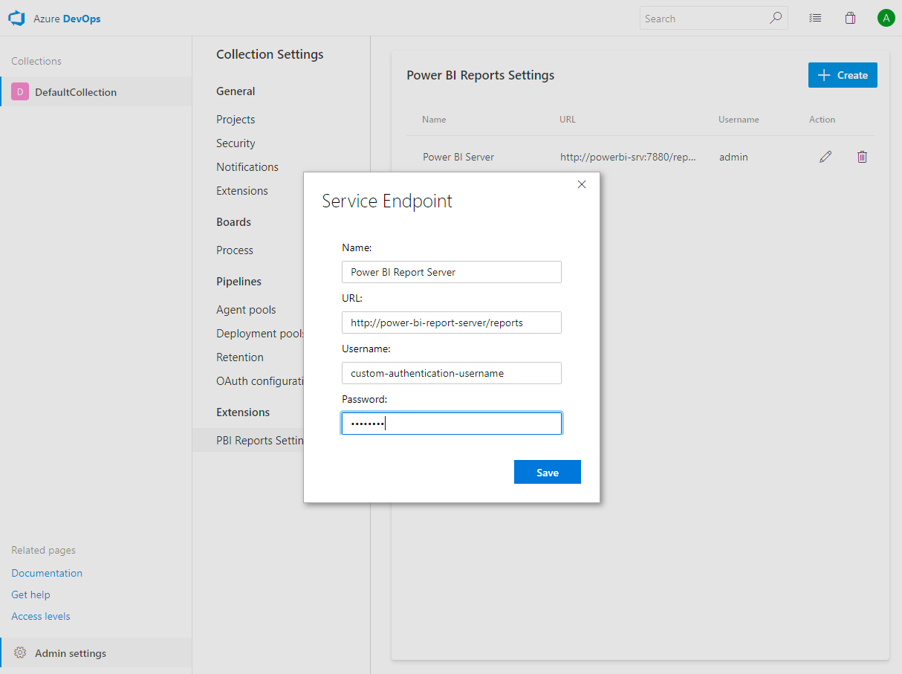
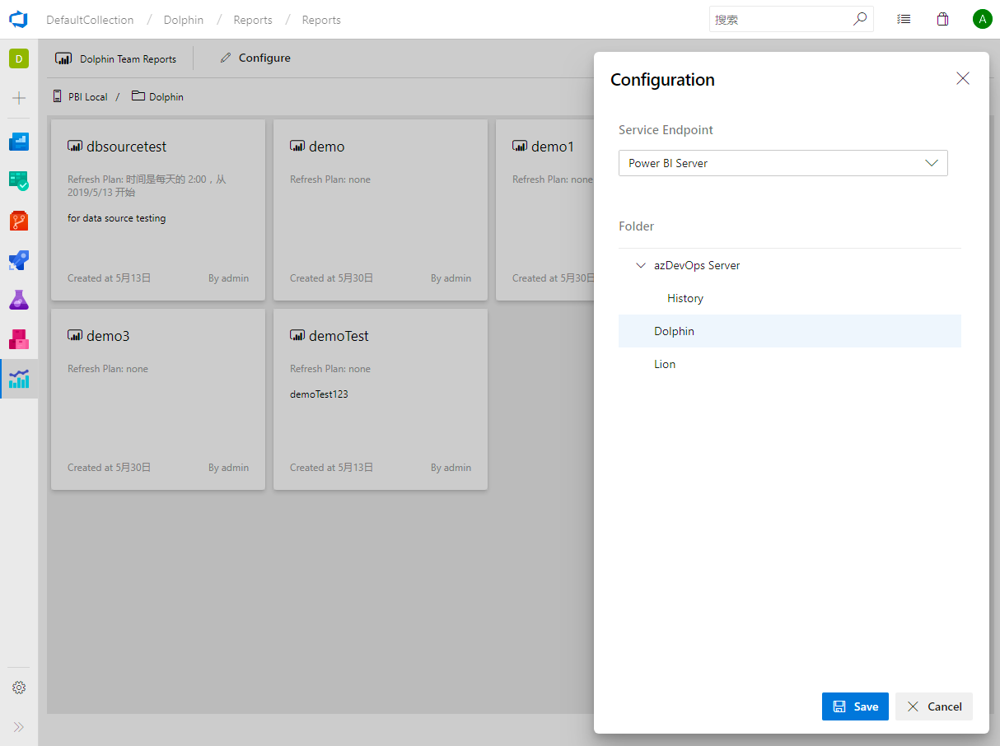
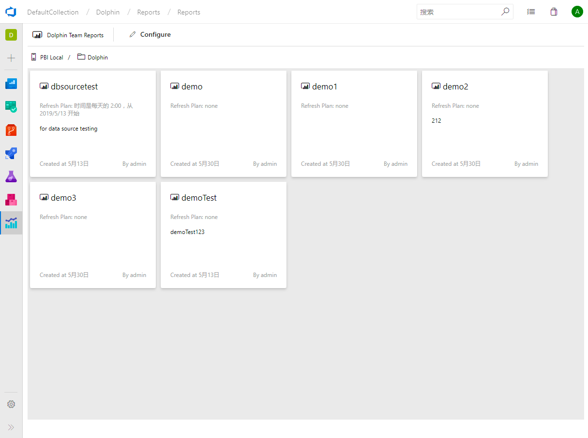
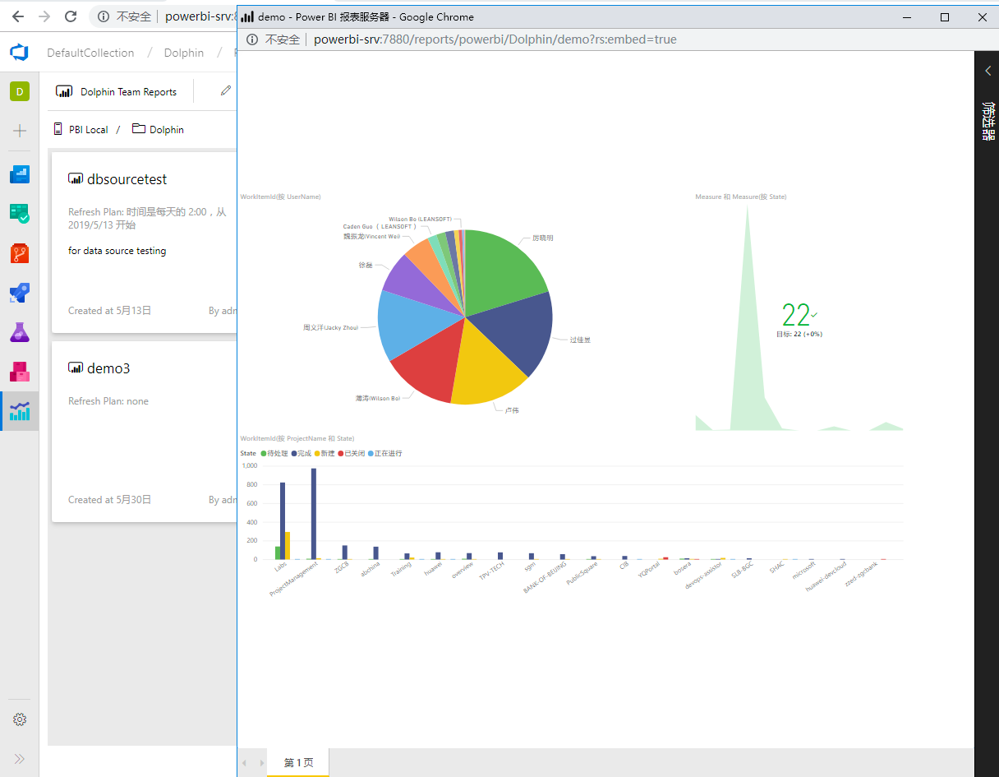

# Power BI Reports Dashboard for Azure Devops

This extension will integrate Power BI Report Server reports (Power BI Services supports will be comming soon) into Azure DevOps. After adding a connection to your Power BI Report Server, you can assoicate a folder of reports to be shown in a Team Project. Users will be able to click a report card to open the report in a pop-up window.

## Prerequiste

Power BI Report Dashboard only support Power BI Reports Server for now, supports for Power BI Services will be comming soon.

You will need to meet the following prerequiste to use this extension:

1. Power BI Report Server is deployed in your environment and you have administrator permission to access it.
2. PBI Server Custom Authentication Enabled: Power BI report server should use the [custom authentication](https://docs.microsoft.com/en-us/sql/reporting-services/security/configure-custom-or-forms-authentication-on-the-report-server?view=sql-server-2017) extension. This is to allow Azure DevOps users to bypass Windows Integrated Security and also enable us to integrate Power BI Report server with your enterprise authentication methods.
3. Cross-Origin Resource Sharing (CORS) should be configured on PBI Server to allow API access. You need to use SQL Management Studio connect to PBI Server and set the following properties

```javascript
AccessControlAllowCredentials = false
AccessControlAllowHeaders = *
AccessControlAllowMethods = *
AccessControlAllowOrigin = *
```

## Supported Azure DevOps Versions

This extension is tested on the following SKUs:

1. Azure DevOps
2. Azure DevOps Server 2019
3. Team Foundation Server 2018

## Quick Start

The following instruction will guide you through the configuartion process.

Once you have the extension installed on your collection, you need to do the following:

1. Add PBI Reports connection

PBI Server connection is added at the Collection/Organization level. Goto **Extensions | PBI Reports Settings** page and add a connection to your PBI Server.



2. Configure Power BI Dashboard for Team Project

A **Power BI Dashboard** hub page will be added for each Team Project. Open this view and click the **Configure** button to associate a Report Folder with your Team Project.



3. Browse the Power BI Report Folder within Azure DevOps

Once the **report folder** is configured for the team porject, you can browse all the reports overview within Azure DevOps.



4. Open and Vew Power BI Report within Azure DevOps

Click on the **report card**, a pop-up window will open and show the actual Power BI report in embeded mode.



## Contribute

Thank you for using **leansoftX.com** extensions, if you have and feedback or issues. You can create issues on our [GitHub repo](https://github.com/leansoftX/PowerBIReportsDashboard). Our Developer will keep watching the events on the repo and get back to your as soon as possible.