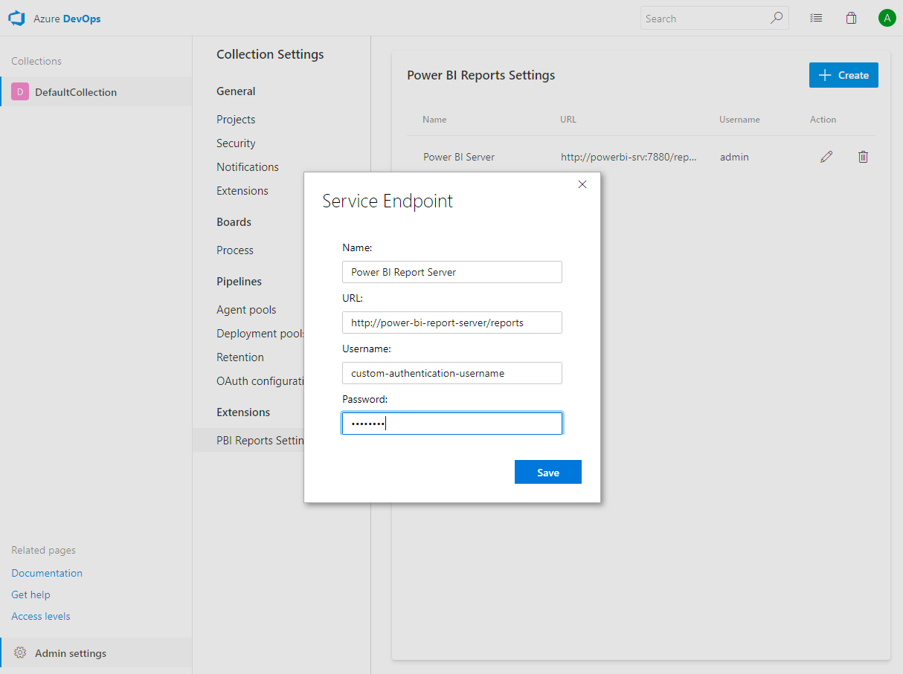
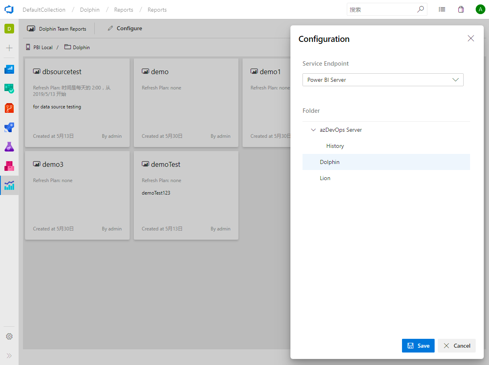
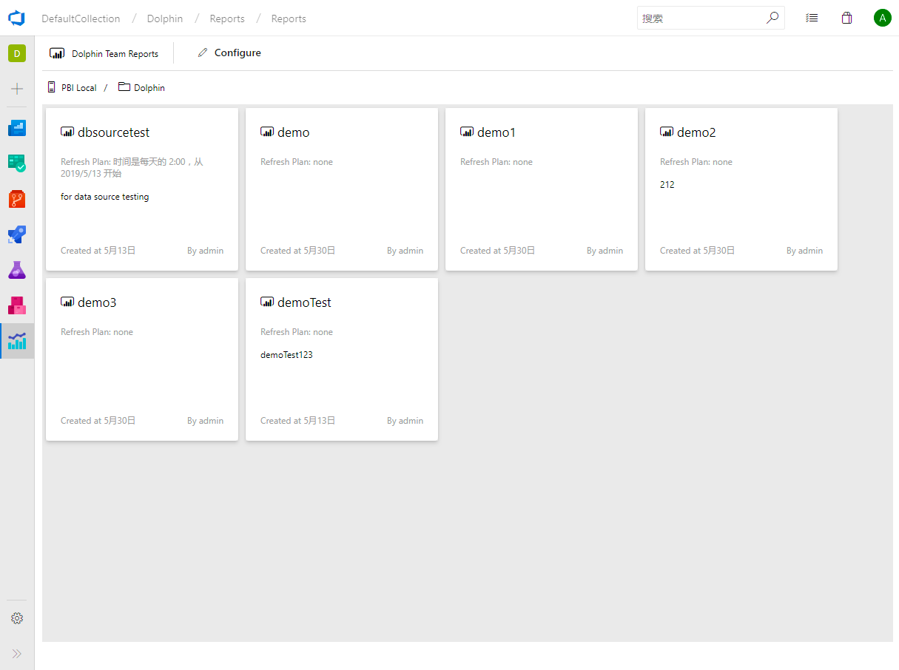
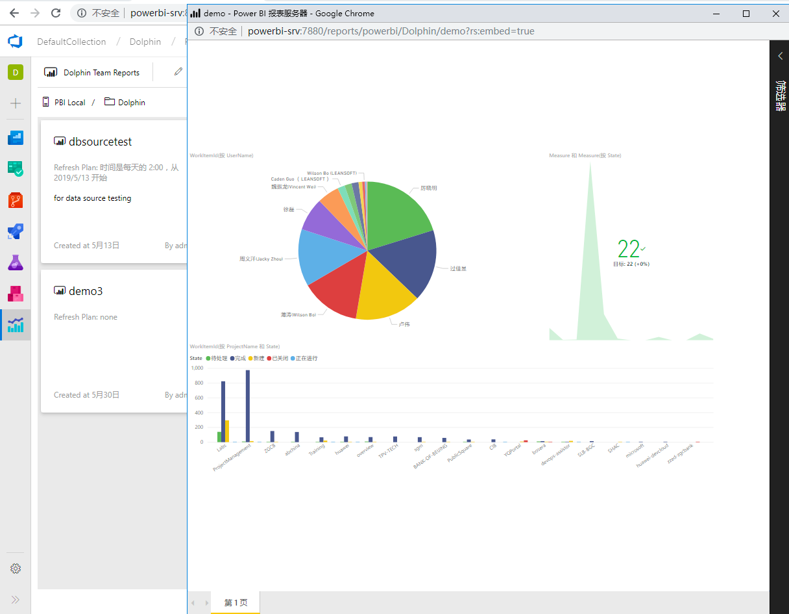

# Power BI report dashboard for azure devops service

This extension is mainly focus on integrate the Power BI Report Server reports with Azure DevOps Service, users can get Power BI Reports summary and redirect to specific report conveniently.

You should use it with configured Power BI report server with the following conditions:
 1. Power BI report server should use the [custom authentication](https://docs.microsoft.com/en-us/sql/reporting-services/security/configure-custom-or-forms-authentication-on-the-report-server?view=sql-server-2017)
 1. Power BI report server should set the value of properties:
 
    ```
    AccessControlAllowCredentials = false
    AccessControlAllowHeaders = *
    AccessControlAllowMethods = *
    AccessControlAllowOrigin = *
    ```

## Quick Start

1. Step into the collection settings and add a service endpoint into Power BI Reports Settings:


1. Step into the Reports hub of specific project the report folder of service endpoints:


1. Get reports summary and redirect the to report detail by clicking the specific report:


1. Pop up the embed report detail page for reference:

